# Web Application Document - Projeto Individual - Módulo 2 - Inteli

#### Autor do projeto
Isabela Rosati Peçanha

## Sumário

1. [Introdução](#c1)  
2. [Visão Geral da Aplicação Web](#c2)  
3. [Projeto Técnico da Aplicação Web](#c3)  
4. [Desenvolvimento da Aplicação Web](#c4)  
5. [Referências](#c5)  

<br>

## <a name="c1"></a>1. Introdução 

O sistema proposto consiste em uma aplicação web para gerenciamento de tarefas, desenvolvida com o objetivo de auxiliar usuários que possuem uma rotina intensa e múltiplas responsabilidades. A plataforma permitirá a criação e organização de tarefas, projetos, equipes, etiquetas e anexos, possibilitando também a categorização das atividades por prioridade e status (como pendente, em andamento e concluída), o que contribui diretamente para uma gestão mais eficiente do tempo e das demandas. A interface será projetada para ser simples, prática e intuitiva, garantindo facilidade de uso.


## <a name="c3"></a>3. Projeto da Aplicação Web

### 3.1. Modelagem do banco de dados 
Modelo relacional
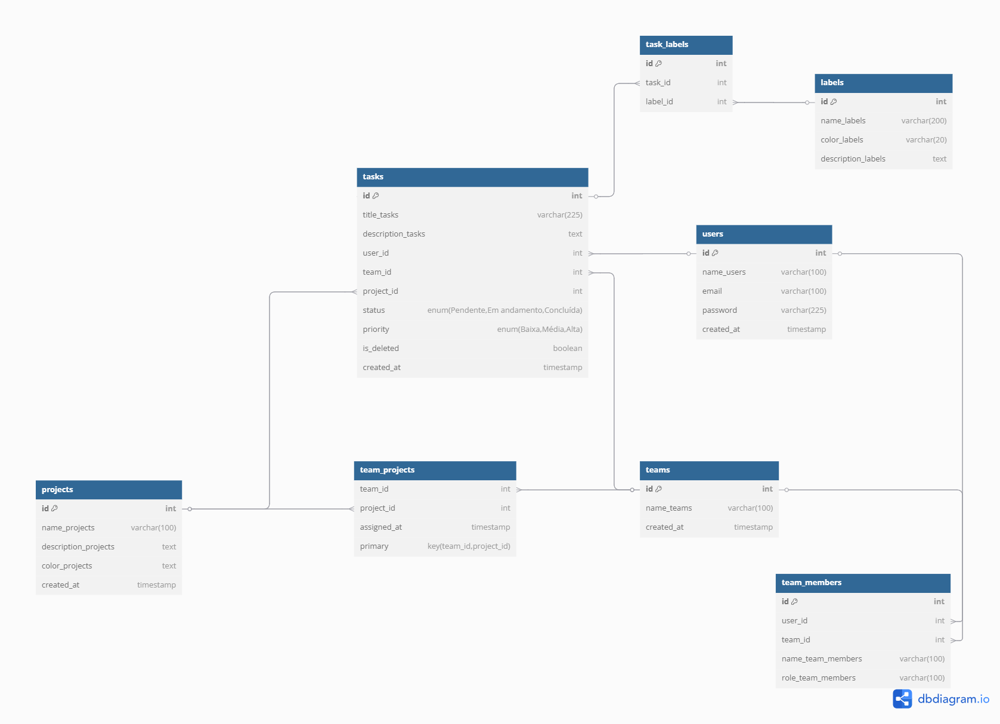

O modelo relacional é uma forma estruturada de organizar os dados de um banco por meio de tabelas, onde cada tabela representa uma entidade (como usuários, tarefas ou projetos), com colunas que definem os atributos e linhas que representam os registros. As tabelas se conectam por chaves primárias e estrangeiras, o que permite relacionar as informações sem repetir dados. 


Modelo Físico
```SQL
-- ENUM 
DO $$ 
BEGIN 
    IF NOT EXISTS (SELECT 1 FROM pg_type WHERE typname = 'task_status') THEN
        CREATE TYPE task_status AS ENUM ('Pendente', 'Em andamento', 'Concluída');
    END IF;
    
    IF NOT EXISTS (SELECT 1 FROM pg_type WHERE typname = 'task_priority') THEN
        CREATE TYPE task_priority AS ENUM ('Baixa', 'Média', 'Alta');
    END IF;
END $$;

-- Users Table
CREATE TABLE IF NOT EXISTS users (
  id SERIAL PRIMARY KEY,
  name_users VARCHAR(100) NOT NULL,
  email VARCHAR(100) UNIQUE NOT NULL,
  password VARCHAR(225) NOT NULL,
  created_at TIMESTAMP DEFAULT CURRENT_TIMESTAMP
);

-- Projects Table
CREATE TABLE IF NOT EXISTS projects (
  id SERIAL PRIMARY KEY,
  name_projects VARCHAR(100) NOT NULL,
  description_projects TEXT,
  color_projects TEXT,
  created_at TIMESTAMP DEFAULT CURRENT_TIMESTAMP
);


-- Teams Table
CREATE TABLE IF NOT EXISTS teams (
  id SERIAL PRIMARY KEY,
  name_teams VARCHAR(100) NOT NULL,
  created_at TIMESTAMP DEFAULT CURRENT_TIMESTAMP
);

-- Tasks Table
CREATE TABLE IF NOT EXISTS tasks (
  id SERIAL PRIMARY KEY,
  title_tasks VARCHAR(225) NOT NULL,
  description_tasks TEXT,
  user_id INT,
  team_id INT,
  project_id INT,
  status task_status DEFAULT 'Pendente',
  priority task_priority DEFAULT 'Média',
  is_deleted BOOLEAN DEFAULT FALSE,
  created_at TIMESTAMP DEFAULT CURRENT_TIMESTAMP,
  FOREIGN KEY (user_id) REFERENCES users(id) ON DELETE SET NULL,
  FOREIGN KEY (team_id) REFERENCES teams(id) ON DELETE SET NULL,
  FOREIGN KEY (project_id) REFERENCES projects(id) ON DELETE SET NULL
);
```
O modelo físico é a etapa onde tudo aquilo que foi pensado no modelo lógico vira código e estrutura real dentro do banco de dados. Nele, definimos exatamente como as tabelas vão ser criadas, os tipos de dados de cada coluna, os índices, restrições e como os dados vão ser armazenados. É onde o banco começa a existir de fato, com comandos SQL que criam as tabelas e relações.


### 3.1.1 BD e Models 
No projeto, foram implementados diversos models para gerenciar as diferentes entidades do banco de dados. Cada model é responsável pela lógica de acesso aos dados e as regras de negócio específicas de cada entidade. Os models implementados no meu projeto são: <br>
**tarefa** -> Responsável pelo gerenciamento das tarefas, ele possui métodos para validar as relações, criar, listar, editar e deletar tarefas.<br>
**usuario** -> Responsável por gerenciar os usuários do sistema, ele possui métodos para criar, editar, deletar e listar os usuários.<br>
**projeto** -> Responsável por controlar os projetos, ele possui métodos para listar, editar, atualizar e deletar projetos.<br>
**time** -> Responsável pela administração dos times, ele possui métodos para listar, criar, atualizar e deletar times.<br>

### 3.2. Arquitetura
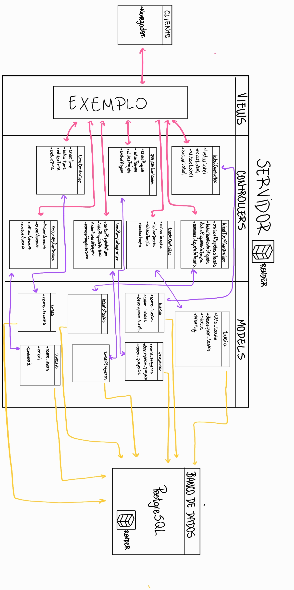

**Fluxo de Dados:**

1. **Cliente → Controller**
   - O cliente faz uma requisição HTTP (GET, POST, PUT, DELETE)
   - A requisição é recebida pelo Controller correspondente (tarefaController, labelController...)

2. **Controller → Model**
   - O Controller processa a requisição
   - Chama os métodos apropriados do Model para acessar/modificar dados
   - Exemplo: `tarefaController` chama `TarefaModel.criar()` para uma nova tarefa

3. **Model → Banco de Dados**
   - O Model executa operações no banco via pool de conexões
   - Realiza validações e aplica regras de negócio
   - Retorna os dados/resultados para o Controller

4. **Controller → Cliente**
   - O Controller formata a resposta (JSON)
   - Envia o código HTTP apropriado 
   - Retorna os dados para o cliente

**Componentes:**
- **Model**: Implementa a lógica de negócios e acesso ao banco PostgreSQL
- **Controller**: Gerencia o fluxo de dados e regras de aplicação
- **Rotas**: Define os endpoints
- **Banco de Dados**: Armazena dados em tabelas relacionais
  
### 3.6. WebAPI e endpoints 

O projeto possui os seguintes endpoints:

#### Tarefas
* GET → `/api/tarefas` → Lista todas as tarefas
* POST → `/api/tarefas/criar` → Cria uma nova tarefa
* PUT → `/api/tarefas/edit/:id` → Atualiza uma tarefa existente
* DELETE → `/api/tarefas/delete/:id` → Remove uma tarefa 

#### Times
* GET → `/api/times` → Lista todos os times
* POST → `/api/times/criar` → Cria um novo time
* PUT → `/api/times/edit/:id` → Atualiza um time
* DELETE → `/api/times/delete/:id` → Remove um time

#### Projetos
* GET → `/api/projetos` → Lista todos os projetos
* POST → `/api/projetos/criar` → Cria um novo projeto
* PUT → `/api/projetos/edit/:id` → Atualiza um projeto
* DELETE → `/api/projetos/delete/:id` → Remove um projeto

#### Usuários
* GET → `/api/usuarios` → Lista todos os usuários
* POST → `/api/usuarios/criar` → Cria um novo usuário
* PUT → `/api/usuarios/edit/:id` → Atualiza um usuário
* DELETE → `/api/usuarios/delete/:id` → Remove um usuário

### 3.7 Interface e Navegação 
O design do site teve como objetivo mostrar algo pratico, mas mantendo um aspecto jovem. Por ser um organizador de tarefas o site foi proejetado para manter um design mais clean, com o bjetivo de o manter funcional e intuitivo. As cores foram escolhidas pensando nesse aspécto, o rosa remete a juventude, em quanto o roxo a criatividade e intuição, reforçando então a proposta. Em termos de código foi utilizado css puro, com uma biblioteca de icones para uma estilização mais agradável. 

Descreva e ilustre aqui o desenvolvimento do frontend do sistema web, explicando brevemente o que foi entregue em termos de código e sistema. Utilize prints de tela para ilustrar.

<h2 align = "center"> Tela de cadastro</h2>

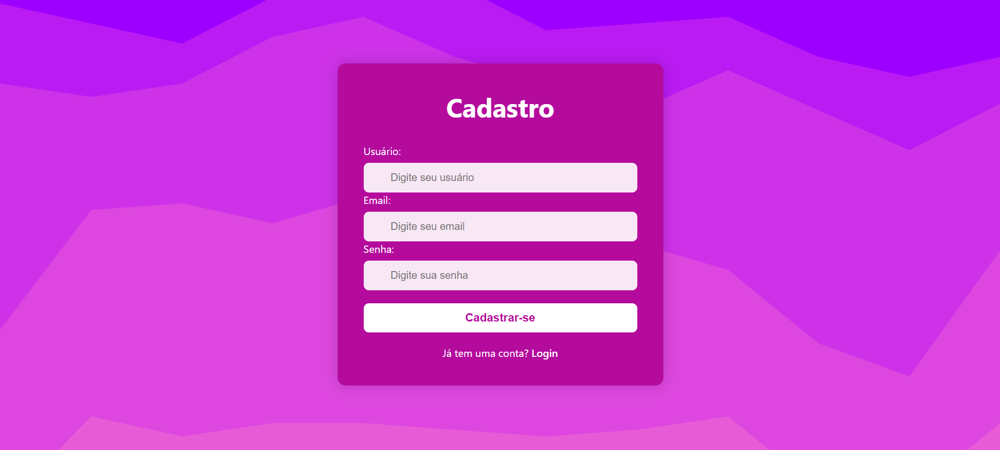

<p align = "center"> Aqui os usuários poderão se cadastrar no site.</p><br>

<h2 align = "center"> Tela de login</h2>

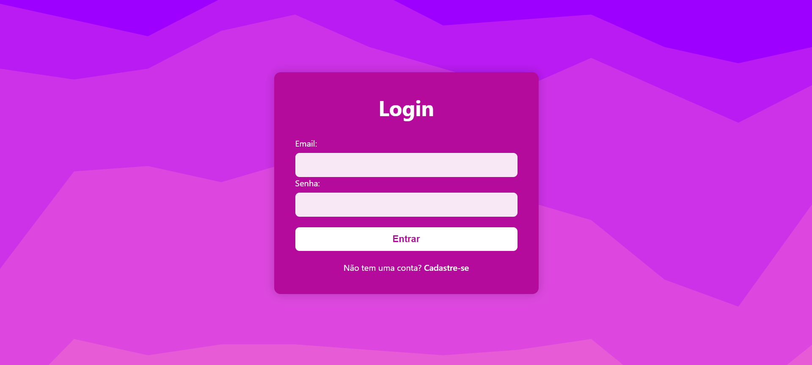

<p align = "center"> Aqui os usuários poderão fazer seu login para acessar suas tarefas.</p><br>

<h2 align = "center"> Kanban</h2>

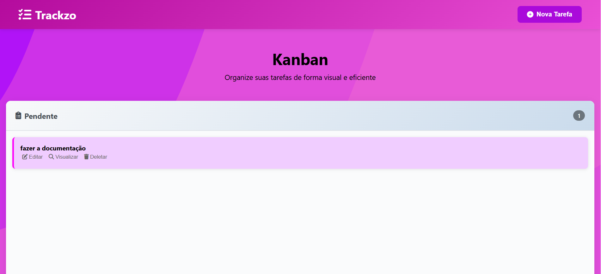
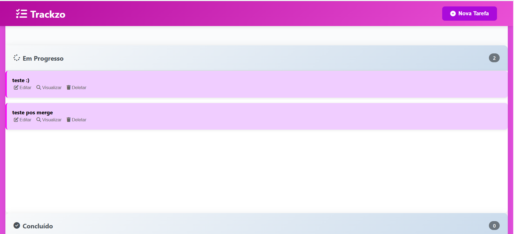
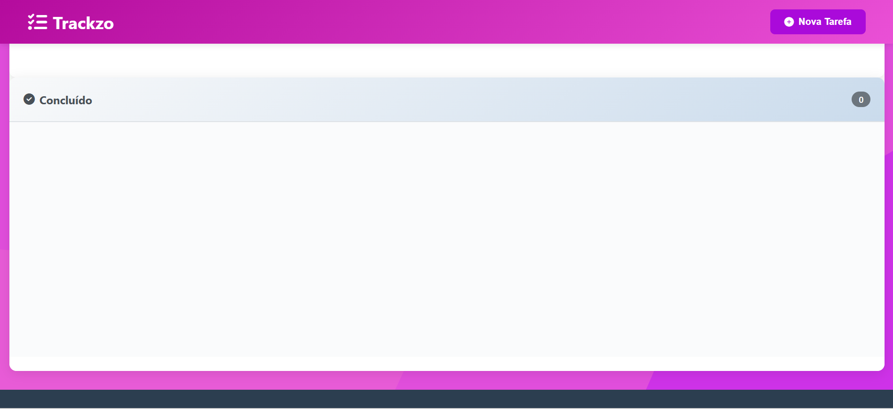

<p align = "center"> Aqui o usuário poderá ver suas tarefas em uma organização estilo kanban, ele poderá também acessar as outras funcionalidades do site como: editar uma tarefa, visualiza-la, apaga-la e criar uma nova.</p><br>

<h2 align = "center"> Nova tarefa</h2>

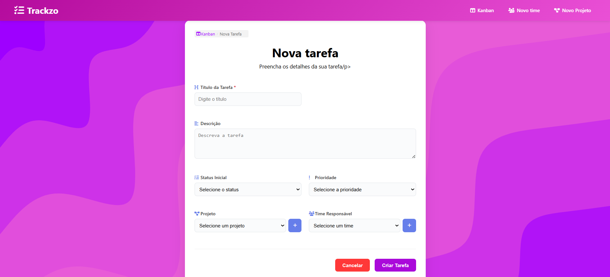

<p align = "center"> Ao clicar no botão de nova tarefa na tela do kanban, o usuário será redirecionado para essa página onde ele poderá inserir as informações que desejar para a tarefa. No canto superior esquerdo podemos observar 3 botões um para ser redirecionado para a pagina de criar um novo time, um para ser redireciona para a pagina de criar u novo projeto e um para voltar ao kanban</p><br>

<h2 align = "center"> Novo time</h2>

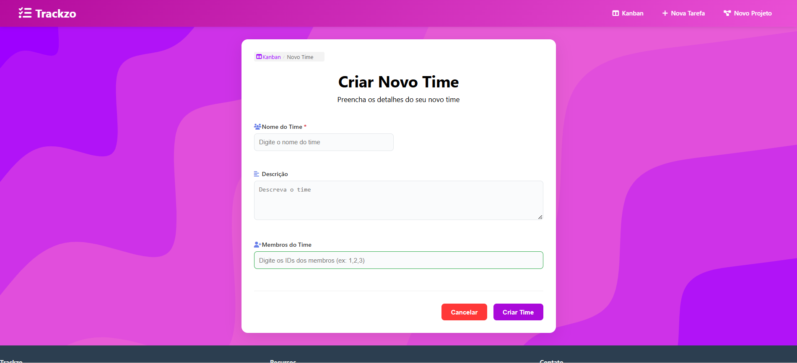

<p align = "center"> Aqui os usuários poderão criar novos times que são podem posteriormente ser vinculados a tarefas.</p><br>

<h2 align = "center"> Novo projeto</h2>

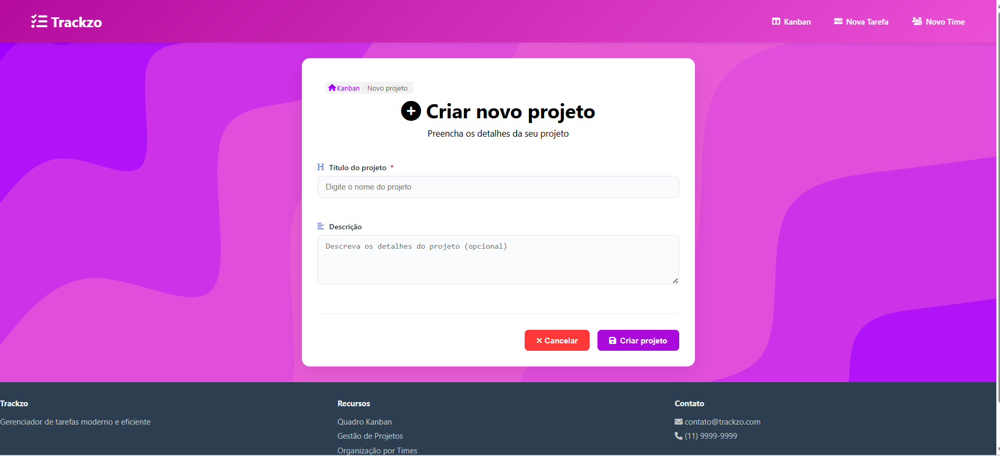

<p align = "center"> Aqui os usuários poderão criar novos projetos que podem posteriormente ser vinculados a tarefas.</p><br>

<h2 align = "center"> Editar tarefa</h2>

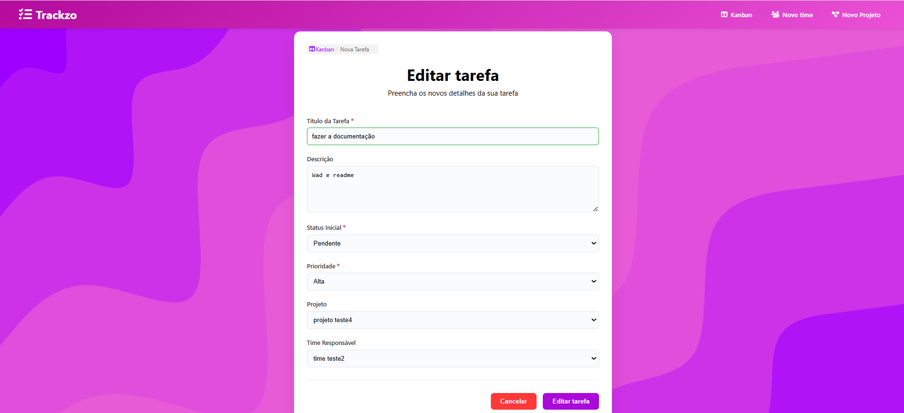

<p align = "center"> Ao cliacar no botão de editar tarefa logo abixo do card dela na tela do kanban o usuário será redirecionado para essa página onde poderá editar dados de uma tarefa já existente.</p><br>

<h2 align = "center"> Visualização da tarefa</h2>

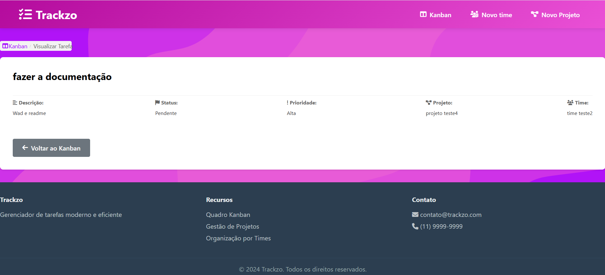

<p align = "center"> Aqui os usuários poderão visualizar todas as informações de sua tarefa. A página pode ser acessada a apartir do clique no botão visualizar no canto inferior direito do card de uma tarefa</p><br>

## <a name="c3"></a>4. Desenvolvimento da Aplicação Web 
### 4.1 Demonstração do Sistema Web 
VIDEO: Insira o link do vídeo demonstrativo nesta seção 

### 4.2 Conclusões e Trabalhos Futuros 
O projeto Trackzo apresenta uma arquitetura MVC bem estruturada, com clara separação de responsabilidades e organização de código por funcionalidade, facilitando manutenção e evolução. O sistema implementa autenticação com segurança de senhas via bcrypt, interface Kanban intuitiva e relacionamentos entre tarefas, projetos e times. Entre os pontos fortes destaca-se também o tratamento de erros com logging adequado. Contudo, há oportunidades de melhoria na implementação de validações mais rigorosas contra injeção SQL, desenvolvimento de testes automatizados e refatoração de código duplicado. Para o futuro, o sistema poderia ter  notificações para tarefas com prazo próximo, sistema de drag-and-drop para o kanban, tags personalizáveis e funcionalidades de anexos.

## <a name="c3"></a> 5. Referências
Incluir as principais referências de seu projeto, para que o leitor possa consultar caso ele se interessar em aprofundar.<br>
<a href="https://nodejs.org/en/docs/">Documentação Node.js</a>  
<a href="https://expressjs.com/pt-br/">Documentação Express.js</a>  
<a href="https://www.postgresql.org/docs/">Documentação PostgreSQL</a>  
<a href="https://ejs.co/">Documentação EJS</a>  
<a href="https://www.npmjs.com/package/bcrypt">Documentação bcrypt</a>  
<a href="https://www.npmjs.com/package/express-session">Documentação Express Session</a>  
