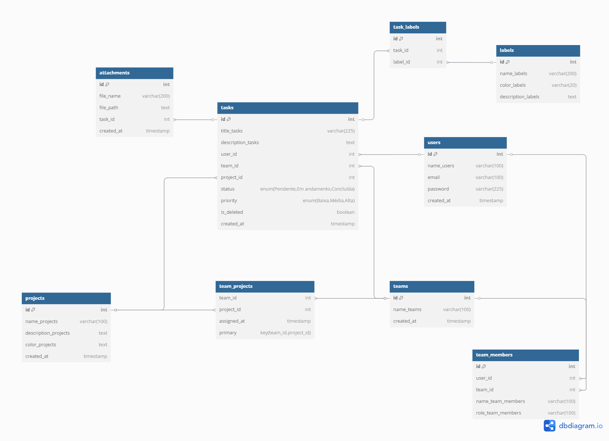

# Web Application Document - Projeto Individual - Módulo 2 - Inteli

#### Autor do projeto
Isabela Rosati Peçanha

## Sumário

1. [Introdução](#c1)  
2. [Visão Geral da Aplicação Web](#c2)  
3. [Projeto Técnico da Aplicação Web](#c3)  
4. [Desenvolvimento da Aplicação Web](#c4)  
5. [Referências](#c5)  

<br>

## <a name="c1"></a>1. Introdução (Semana 01)

O sistema proposto consiste em uma aplicação web para gerenciamento de tarefas, desenvolvida com o objetivo de auxiliar usuários que possuem uma rotina intensa e múltiplas responsabilidades. A plataforma permitirá a criação e organização de tarefas, projetos, equipes, etiquetas e anexos, possibilitando também a categorização das atividades por prioridade e status (como pendente, em andamento e concluída), o que contribui diretamente para uma gestão mais eficiente do tempo e das demandas. A interface será projetada para ser simples, prática e intuitiva, garantindo facilidade de uso.


## <a name="c3"></a>3. Projeto da Aplicação Web

### 3.1. Modelagem do banco de dados  (Semana 3)
Modelo relacional


Modelo Físico
```SQL
-- ENUM 
CREATE TYPE task_status AS ENUM ('Pendente', 'Em andamento', 'Concluída');
CREATE TYPE task_priority AS ENUM ('Baixa', 'Média', 'Alta');

-- Users Table
CREATE TABLE users (
  id SERIAL PRIMARY KEY,
  name_users VARCHAR(100) NOT NULL,
  email VARCHAR(100) UNIQUE NOT NULL,
  password VARCHAR(225) NOT NULL,
  created_at TIMESTAMP DEFAULT CURRENT_TIMESTAMP
);

-- Projects Table
CREATE TABLE projects (
  id SERIAL PRIMARY KEY,
  name_projects VARCHAR(100) NOT NULL,
  description_projects TEXT,
  color_projects TEXT,
  created_at TIMESTAMP DEFAULT CURRENT_TIMESTAMP
);

-- Teams Table
CREATE TABLE teams (
  id SERIAL PRIMARY KEY,
  name_teams VARCHAR(100) NOT NULL,
  created_at TIMESTAMP DEFAULT CURRENT_TIMESTAMP
);

-- Team-Projects Table
CREATE TABLE team_projects (
  team_id INT NOT NULL,
  project_id INT NOT NULL,
  assigned_at TIMESTAMP DEFAULT CURRENT_TIMESTAMP,
  PRIMARY KEY (team_id, project_id),
  FOREIGN KEY (team_id) REFERENCES teams(id) ON DELETE CASCADE,
  FOREIGN KEY (project_id) REFERENCES projects(id) ON DELETE CASCADE
);

CREATE INDEX idx_team_projects_team ON team_projects(team_id);
CREATE INDEX idx_team_projects_project ON team_projects(project_id);

-- Team Members Table
CREATE TABLE team_members (
  id SERIAL PRIMARY KEY,
  user_id INT NOT NULL,
  team_id INT NOT NULL,
  name_team_members VARCHAR(100) NOT NULL,
  role_team_members VARCHAR(100) NOT NULL,
  FOREIGN KEY (user_id) REFERENCES users(id) ON DELETE CASCADE,
  FOREIGN KEY (team_id) REFERENCES teams(id) ON DELETE CASCADE
);

-- Tasks Table
CREATE TABLE tasks (
  id SERIAL PRIMARY KEY,
  title_tasks VARCHAR(225) NOT NULL,
  description_tasks TEXT,
  user_id INT,
  team_id INT,
  project_id INT,
  status task_status DEFAULT 'Pendente',
  priority task_priority DEFAULT 'Média',
  is_deleted BOOLEAN DEFAULT FALSE,
  created_at TIMESTAMP DEFAULT CURRENT_TIMESTAMP,
  FOREIGN KEY (user_id) REFERENCES users(id) ON DELETE SET NULL,
  FOREIGN KEY (team_id) REFERENCES teams(id) ON DELETE SET NULL,
  FOREIGN KEY (project_id) REFERENCES projects(id) ON DELETE SET NULL
);

-- Labels Table 
CREATE TABLE labels (
  id SERIAL PRIMARY KEY,
  name_labels VARCHAR(200) NOT NULL,
  color_labels VARCHAR(20) DEFAULT ('#898989'),
  description_labels TEXT
);

-- Task-Labels Table
CREATE TABLE task_labels (
  id SERIAL PRIMARY KEY,
  task_id INT NOT NULL,
  label_id INT NOT NULL,
  FOREIGN KEY (task_id) REFERENCES tasks(id) ON DELETE CASCADE,
  FOREIGN KEY (label_id) REFERENCES labels(id) ON DELETE CASCADE
);

CREATE INDEX idx_task_labels_task ON task_labels(task_id);
CREATE INDEX idx_task_labels_label ON task_labels(label_id);

-- Attachments Table
CREATE TABLE attachments (
  id SERIAL PRIMARY KEY,
  file_name VARCHAR(200) NOT NULL,
  file_path TEXT NOT NULL,
  task_id INT NOT NULL,
  created_at TIMESTAMP DEFAULT CURRENT_TIMESTAMP,
  FOREIGN KEY (task_id) REFERENCES tasks(id) ON DELETE CASCADE
);
```

### 3.1.1 BD e Models (Semana 5)
*Descreva aqui os Models implementados no sistema web*

### 3.2. Arquitetura (Semana 5)

*Posicione aqui o diagrama de arquitetura da sua solução de aplicação web. Atualize sempre que necessário.*

**Instruções para criação do diagrama de arquitetura**  
- **Model**: A camada que lida com a lógica de negócios e interage com o banco de dados.
- **View**: A camada responsável pela interface de usuário.
- **Controller**: A camada que recebe as requisições, processa as ações e atualiza o modelo e a visualização.
  
*Adicione as setas e explicações sobre como os dados fluem entre o Model, Controller e View.*

### 3.3. Wireframes (Semana 03 - opcional)

*Posicione aqui as imagens do wireframe construído para sua solução e, opcionalmente, o link para acesso (mantenha o link sempre público para visualização).*

### 3.4. Guia de estilos (Semana 05 - opcional)

*Descreva aqui orientações gerais para o leitor sobre como utilizar os componentes do guia de estilos de sua solução.*


### 3.5. Protótipo de alta fidelidade (Semana 05 - opcional)

*Posicione aqui algumas imagens demonstrativas de seu protótipo de alta fidelidade e o link para acesso ao protótipo completo (mantenha o link sempre público para visualização).*

### 3.6. WebAPI e endpoints (Semana 05)

*Utilize um link para outra página de documentação contendo a descrição completa de cada endpoint. Ou descreva aqui cada endpoint criado para seu sistema.*  

### 3.7 Interface e Navegação (Semana 07)

*Descreva e ilustre aqui o desenvolvimento do frontend do sistema web, explicando brevemente o que foi entregue em termos de código e sistema. Utilize prints de tela para ilustrar.*

---

## <a name="c4"></a>4. Desenvolvimento da Aplicação Web (Semana 8)

### 4.1 Demonstração do Sistema Web (Semana 8)

*VIDEO: Insira o link do vídeo demonstrativo nesta seção*
*Descreva e ilustre aqui o desenvolvimento do sistema web completo, explicando brevemente o que foi entregue em termos de código e sistema. Utilize prints de tela para ilustrar.*

### 4.2 Conclusões e Trabalhos Futuros (Semana 8)

*Indique pontos fortes e pontos a melhorar de maneira geral.*
*Relacione também quaisquer outras ideias que você tenha para melhorias futuras.*


## <a name="c5"></a>5. Referências

_Incluir as principais referências de seu projeto, para que o leitor possa consultar caso ele se interessar em aprofundar._<br>

---
---
